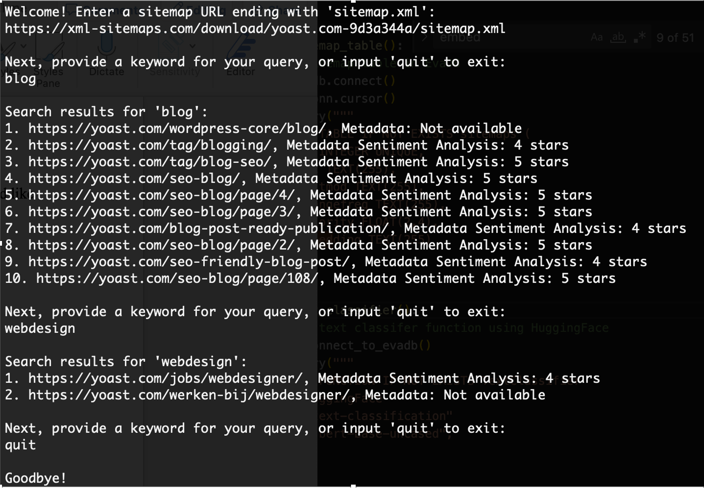

# EvaSEO Insight
EvaSEO Insight is a powerful tool integrated with EvaDB designed to fetch and parse sitemaps from a given URL and then generate embeddings for the fetched data. Leveraging the capabilities of DistilBERT, this tool provides a robust method to embed website data for further analysis. This document provides a comprehensive guide to the tool's features, implementation details, and usage.

# Features
- Fetch and parse XML sitemaps from given URLs.
- Convert sitemap data into embeddings using DistilBERT.
- Efficiently chunk sitemap data for manageable processing.
- Integrate with external database (evadb) for data storage and retrieval.
- Advanced search capabilities using embeddings.

# Implementation Details
- XML Parsing: Uses Python's xml.etree.ElementTree to parse XML sitemaps.
- Fetching Sitemaps: Utilizes the requests library to fetch sitemaps with a 30-second timeout.
- Embeddings: Employs the DistilBERT tokenizer and model from the transformers library to convert data chunks into vector embeddings.
- FAISS Indexing: Uses FAISS for storing and searching through embeddings efficiently.
- EvaDB Integration: Connects with evadb for creating tables, storing data, and querying the database.
- Metadata Extraction: Uses BeautifulSoup to extract meta description and keywords from URLs.
- Sentiment Analysis: Integrates with HuggingFace models through evadb to provide sentiment analysis for metadata.

# Setup
- Ensure all required libraries are installed:
```pip install -r requirements.txt```
- Run the program:
```python sitemap_analysis.py```

# Interactive CLI
Upon initiation, users are guided to:
- Input a sitemap URL, ensuring it concludes with 'sitemap.xml'.
- Key in a keyword or query to retrieve pertinent results from the sitemap.
Subsequently, the program fetches sitemap data, archives it into a CSV file, connects to EvaDB, initializes the FAISS index, and presents search results. Each result is enriched with metadata sentiment analysis.



# Use Cases
- Website Scrutiny: Fetching and decoding the sitemap illuminates the structure and content of a website, offering invaluable insights.
- Embedding Creation: Transform URLs or select data chunks into embeddings, paving the way for further analysis or ML operations.
- Seamless DB Integration: Link effortlessly with evadb to archive and query data, epitomizing scalability for expansive websites.

# Future Directions
- Search Enhancement: Infuse advanced search algorithms to elevate accuracy and result relevance.
- UI Evolution: Migrate from a CLI-centric tool towards a GUI, championing user experience.
- Data Source Expansion: Augment the tool's prowess to interpret and analyze diverse data formats or sources.
- Optimization: Infuse caching or other strategies to supercharge data processing and retrieval velocities.
